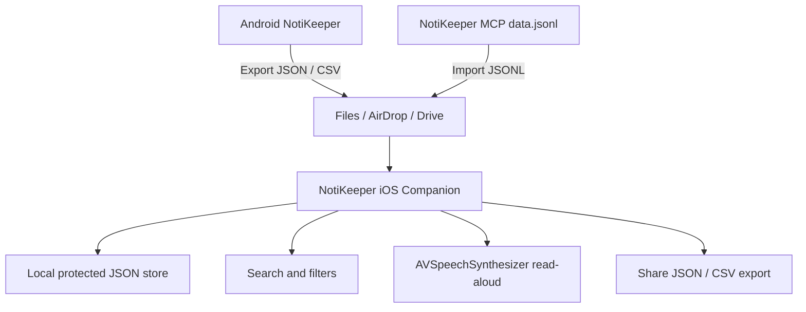

# PRD - NotiKeeper iOS Companion

## 1. Context

NotiKeeper Android v1.6 เป็นแอปหลักที่เก็บ notification และข้อความบนหน้าจอผ่าน Android-only APIs:

- `NotificationListenerService`
- `AccessibilityService`
- Android Keystore / EncryptedSharedPreferences
- SQLCipher local database

iOS ไม่เปิด API ให้แอป third-party อ่าน notification ของแอปอื่น หรืออ่าน accessibility tree ของแอปอื่นบนเครื่องปกติ ดังนั้น iOS edition ต้องเป็น companion app สำหรับอ่าน ค้นหา นำเข้า ส่งออก และฟังข้อมูล archive ที่ Android หรือ server ส่วนตัวส่งออกมาแล้ว

## 2. Goal

สร้าง iOS companion app แบบ SwiftUI ที่เปิดใน Xcode ได้ และรองรับ workflow ส่วนตัว:

1. นำเข้าไฟล์ JSON/CSV จาก Android NotiKeeper export หรือ `mcp-server/data.jsonl`
2. เก็บ archive ไว้ในเครื่อง iPhone พร้อม app lock ผ่าน Face ID / device passcode
3. ค้นหาและกรองข้อความตาม app/source/text
4. อ่านข้อความออกเสียงสำหรับ eyes-free review
5. ส่งออก archive กลับเป็น JSON/CSV ได้

## 3. Non-goals

- ไม่ดัก notification ของแอปอื่นบน iOS
- ไม่อ่านหน้าจอ Messenger/LINE/IG/WhatsApp/Telegram บน iOS
- ไม่ bypass sandbox, jailbreak, private API หรือ enterprise-only surveillance API
- ไม่ทำ public App Store distribution ใน v0.1
- ไม่เปลี่ยน Android app behavior เดิม

## 4. Architecture

## 5. Functional Requirements

| ID | Requirement | Priority |
|---|---|---|
| IOS-1 | Import Android-compatible JSON array with fields `id, source, app, pkg, title, text, side, time` | Must |
| IOS-2 | Import CSV from Android export header `id,source,app,title,text,side,time` | Must |
| IOS-3 | Import JSONL rows from MCP server data file | Should |
| IOS-4 | Deduplicate imported rows across repeated imports | Must |
| IOS-5 | Search across app name, title, message text, source, and side | Must |
| IOS-6 | Filter by source: all / notification / screen | Must |
| IOS-7 | Filter by app name from imported archive | Should |
| IOS-8 | Lock archive UI with Face ID / device passcode where configured | Must |
| IOS-9 | Read selected message aloud through iOS speech synthesis | Should |
| IOS-10 | Export local archive as JSON and CSV using the system share sheet | Must |

## 6. Acceptance Criteria

- Opening `ios/NotiKeeperIOS/NotiKeeperIOS.xcodeproj` in Xcode shows the `NotiKeeperIOS` app scheme.
- The app compiles for iOS Simulator on macOS with Xcode 15+.
- Importing a JSON export from Android shows rows in newest-first order.
- Importing the same file twice does not duplicate rows.
- Search and source/app filters update the list.
- A message row can be spoken aloud and stopped.
- Export creates portable JSON or CSV files.

## 7. Risk Assessment

Risk level: HIGH

Reasons:

- This is a platform-port boundary, not an APK-to-IPA conversion.
- Core Android capture APIs have no equivalent on normal iOS devices.
- Build verification requires macOS + Xcode; this Windows workspace can only verify file structure unless XcodeBuildMCP is backed by a Mac environment.

Mitigation:

- Keep iOS scope as companion archive viewer, not capture agent.
- Preserve Android app as canonical capture source.
- Document iOS limitations explicitly in product scope.

## CHANGELOG

| Version | Date | Status | Summary | Commit Hash | Agent |
|---------|------|--------|---------|-------------|-------|
| 0.1.0b | 2026-06-26 | beta | Approved iOS companion scope and architecture. | pending | ATHER |
